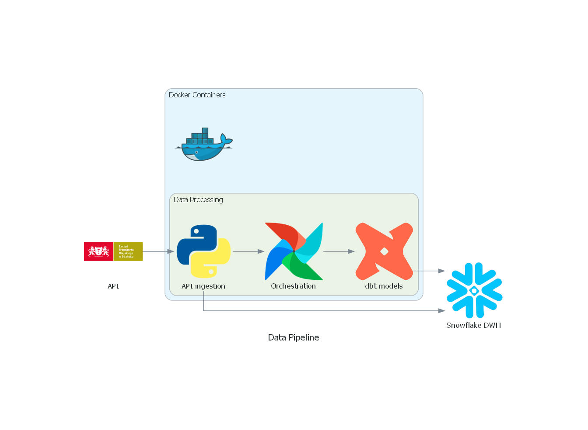

# gdansk-transport-etl-dbt-ai

## Project Description:
This part of the project implements a comprehensive ETL (Extract, Transform, Load) pipeline for processing public transport data using Apache Airflow orchestration and Snowflake as the data warehouse. The pipeline extracts data from public transport APIs for the [City of Gdańsk](https://www.gdansk.pl/otwarte-dane-w-gdansku?show=data&id=tristar&s=byGroup&i=transport), transforms and cleans the data, and loads it into a structured database for analysis and reporting.
The system is designed to handle public transport information including delays, routes, schedules and vehicle positions, providing insights for transport planning and optimization.

## Technologies Used:
* Apache Airflow: Workflow orchestration and scheduling
* Snowflake: Primary data warehouse for data storage
* Docker & Docker Desktop: Containerization platform
* Astro CLI: Airflow development environment
* dbt (Data Build Tool): Data transformation and modeling
* Python: Main programming language for data processing
* Ubuntu/WSL: Linux development environment

## Key Features:
* Automated data extraction from public transport APIs
* Data validation and quality checks
* Incremental data loading strategies
* Monitoring and alerting capabilities
* Scalable architecture using Docker containers

## Project Architecture:
* Data Extraction: APIs → Raw data ingestion
* Data Transformation: dbt models for data cleaning and business logic
* Data Loading: Processed data → Snowflake warehouse
* Orchestration: Airflow DAGs managing the entire pipeline


## Project Setup:
1. **Install Ubuntu on Windows using WSL**`
   To run Ubuntu on Windows, first install WSL (Windows Subsystem for Linux). Open PowerShell as Administrator and run:
      ```sh
         wsl --install
      ```
   This will install WSL and the default Linux distribution. If you want a specific Ubuntu version, you can download it from the Microsoft Store after installing WSL.

2. **Install Docker Desktop**
   Download and install [Docker Desktop](https://www.docker.com/products/docker-desktop/) 

3. **Create free Snowflake account**
   Create a free Snowflake account and note the account details.

4. **Install Astro CLI**
   Install Astro CLI by following the official [installation instructions](https://www.astronomer.io/docs/astro/cli/install-cli)

5. **Initialize a New Astro Project**
   Open WSL and run the following commands:
      ```sh
         mkdir <your_project_dirtectory>

         cd <your_project_dirtectory>

         astro dev init
      ```
   This will initialize a new Astro project.

6. **Set Up Dependencies**
   Open the project in VS Code:
      ```sh
         code .
      ```
   
   Install system dependencies. Open `packages.txt` and add:
      ```nginx
         gcc
         python3-dev
      ```
   Install Python dependencies. Open `requirements.txt` and add:
      ```css
         astronomer-cosmos
         apache-airflow-providers-snowflake
         snowflake-connector-python
         snowflake-sqlalchemy
      ```
   
   Set up DBT in a virtual environment. In the `Dockerfile` add:
      ```dockerfile
         FROM astrocrpublic.azurecr.io/runtime:3.1-13

         RUN python -m venv dbt_venv && source dbt_venv/bin/activate && \
            pip install --no-cache-dir dbt-snowflake && deactivate
      ```

7. **Clone Repository and Replace DAGS**
   Clone project repository:
      ```sh
         git clone https://github.com/filipkonkel97/gdansk-transport-etl-dbt-ai.git
      ```
   Then replace the project's DAG folder with the repository's DAG folder.

8. **Start Airflow**
   From the command prompt, run:
      ```sh
         astro dev start
      ```

9. **Configure Snowflake Connection in Airflow UI**
   Open your browser and go to:
      ```arduino
         localhost:8080
      ```
   Navigate to `Admin`→`Connections`→`Add Connection`, select 'Snowflake' and provide your login, password, account identifier, warehouse and database.

## Future Improvements

- Implement an AI-powered data analyst for natural language queries
- Build interactive dashboards for transport performance monitoring